# InsightBoard CRM Dashboard

A full-stack CRM dashboard built for a small web design business. InsightBoard helps manage the complete business workflow from client acquisition to deal tracking, project delivery, revenue, expenses, profit visibility, and business reporting.

## Live Demo

**Demo:** https://insightboard-one.vercel.app

### Demo Login

```txt
Email: admin@insightboard.demo
Password: Admin@123456
```

> The public demo runs in view-only mode. Data mutation actions such as create, update, delete, and deal conversion are disabled for security.

---

## Project Purpose

InsightBoard was built as a portfolio-ready full-stack CRM system for a web design business. The goal is to demonstrate practical software engineering skills across frontend development, backend API design, database modeling, authentication, validation, reporting, and deployment.

The CRM follows this real business workflow:

```txt
Client → Deal → Project → Revenue / Expenses → Profit → Reports
```

Instead of tracking business activity across spreadsheets, notes, and separate tools, InsightBoard centralizes the main business operations inside one private dashboard.

---

## Core Features

### Authentication & Access Control

- Admin login system
- JWT-based authentication
- Password hashing with bcrypt
- Protected dashboard pages
- Protected API routes
- Current-user session validation
- Demo mode protection for public deployment

### Landing Page

- Premium SaaS-style homepage
- Dark/light theme toggle
- Arabic/English language toggle
- Public project overview
- Animated dashboard screenshot showcase
- Portfolio and contact links
- Admin portal call-to-action

### Dashboard Overview

- Total clients
- Active deals
- Total revenue
- Net profit
- Recent deals
- Revenue summary
- Monthly revenue chart
- Deals pipeline chart
- Project status chart

### Clients Management

- Create, read, update, and delete client records
- Soft delete support
- Search and pagination
- View client details
- Track company information, business type, contact person, phone, email, location, website, status, description, and notes

### Deals Pipeline

- Create, read, update, and delete deals
- Soft delete support
- Search and pagination
- Deal status tracking
- Expected close date tracking
- Probability tracking
- Estimated budget and final price
- View deal details
- Convert closed-won deals into projects

### Deal-to-Project Conversion

A deal can be converted into a project only when its status is:

```txt
Closed Won
```

The backend validates:

- Deal exists
- Deal is not deleted
- Deal status is Closed Won
- Deal has not already been converted
- Related client exists
- Final price or estimated budget is valid
- Deadline is valid

This prevents invalid or duplicate project creation.

### Projects Management

- Create, read, update, and delete projects
- Soft delete support
- Search and pagination
- Link projects to clients and deals
- Track project type, price, cost, profit, deadline, status, payment status, description, and notes
- Automatic profit calculation

```txt
profit = price - cost
```

### Revenue Tracking

- Create, read, update, and delete revenue records
- Link revenue to projects and clients
- Automatic client lookup through the selected project
- Track amount, payment method, payment date, description, and notes
- Supported payment methods:

```txt
Cash
BenefitPay
Bank Transfer
Card
Other
```

### Expenses Tracking

- Create, read, update, and delete expense records
- Track project-related costs
- Track amount, category, date, description, and notes
- Supported expense categories:

```txt
Domain
Hosting
Design Assets
Tools
Ads
Freelance Help
Other
```

### Reports & Insights

- Finance summary
- Monthly finance report
- Project finance report
- Client finance report
- Project type finance report
- Deals overview
- Clients overview
- Projects overview
- Revenue records
- Expense records
- Search and pagination inside report tables
- Day/month/client filters
- Filtered print panel
- Print/PDF-ready report output
- Excel export using XLSX

### Settings

- Business name preference
- Theme mode preference
- Local browser-based settings for demo preview
- Dark mode, light mode, and system mode support through the theme provider
### Custom 404 Page

- Branded custom not-found page
- Clear navigation back to the homepage or dashboard
- Consistent InsightBoard visual style
### Demo Mode

Demo mode is controlled using environment variables:


When enabled, backend mutation routes return:

```txt
403 Forbidden
This demo is view-only. Changes are disabled for security.
```

This protects the public deployment while still allowing visitors to explore the dashboard UI and read existing data.

---

## Tech Stack

### Frontend

- Next.js 16 App Router
- React 19
- TypeScript
- MUI
- Tailwind CSS
- Recharts
- Next Image
- Responsive design
- Dark/light theme support

### Backend

- Next.js API Routes
- Node.js runtime
- REST-style API structure
- JWT authentication
- bcrypt password hashing
- Centralized API response helpers
- Server-side validation
- Demo mode mutation guard

### Database

- MongoDB Atlas
- Mongoose
- Database connection caching
- Mongoose schemas and relationships
- Soft delete pattern
- Populated references

### Tools

- Git / GitHub
- Postman
- Vercel
- ESLint
- XLSX export

---
## Database Models

### User

Stores admin user accounts.

Main fields:

```txt
name
email
password
role
createdAt
updatedAt
```

Passwords are hashed before storage.

### Client

Represents companies or potential customers.

Main fields:

```txt
companyName
businessType
contactPerson
phone
email
location
website
status
description
notes
isDeleted
createdAt
updatedAt
```

### Deal

Represents a sales opportunity before it becomes a project.

Main fields:

```txt
clientId
title
estimatedBudget
finalPrice
status
probability
expectedCloseDate
description
notes
isDeleted
createdAt
updatedAt
```

Deal statuses:

```txt
Lead
Contacted
Proposal Sent
Negotiation
Closed Won
Closed Lost
```

### Project

Represents actual work after a deal is won.

Main fields:

```txt
clientId
dealId
name
type
price
cost
profit
deadline
status
paymentStatus
description
notes
isDeleted
createdAt
updatedAt
```

Project types:

```txt
Landing Page
Business Website
Portfolio Website
E-commerce Website
Redesign
Maintenance
```

Project statuses:

```txt
Not Started
In Progress
Review
Completed
Cancelled
```

Payment statuses:

```txt
Unpaid
Partially Paid
Paid
```

### Revenue

Represents money received from clients.

Main fields:

```txt
projectId
clientId
amount
paymentDate
paymentMethod
description
notes
createdAt
updatedAt
```

### Expense

Represents business or project-related cost.

Main fields:

```txt
projectId
title
amount
category
date
description
notes
createdAt
updatedAt
```

---

## API Routes

### Auth

| Method | Route | Description |
|---|---|---|
| POST | `/api/auth/register` | Create the first admin account |
| POST | `/api/auth/login` | Login and return JWT token |
| POST | `/api/auth/logout` | Logout endpoint |
| GET | `/api/auth/me` | Get current authenticated user |

### Clients

| Method | Route | Description |
|---|---|---|
| GET | `/api/clients` | Get paginated clients |
| POST | `/api/clients` | Create client |
| GET | `/api/clients/[id]` | Get single client |
| PUT | `/api/clients/[id]` | Update client |
| DELETE | `/api/clients/[id]` | Soft delete client |

### Deals

| Method | Route | Description |
|---|---|---|
| GET | `/api/deals` | Get paginated deals |
| POST | `/api/deals` | Create deal |
| GET | `/api/deals/[id]` | Get single deal |
| PUT | `/api/deals/[id]` | Update deal |
| DELETE | `/api/deals/[id]` | Soft delete deal |
| POST | `/api/deals/[id]/convert-to-project` | Convert closed-won deal into project |

### Projects

| Method | Route | Description |
|---|---|---|
| GET | `/api/projects` | Get paginated projects |
| POST | `/api/projects` | Create project |
| GET | `/api/projects/[id]` | Get single project |
| PUT | `/api/projects/[id]` | Update project |
| DELETE | `/api/projects/[id]` | Soft delete project |

### Revenue

| Method | Route | Description |
|---|---|---|
| GET | `/api/revenue` | Get paginated revenue records |
| POST | `/api/revenue` | Create revenue record |
| GET | `/api/revenue/[id]` | Get single revenue record |
| PUT | `/api/revenue/[id]` | Update revenue record |
| DELETE | `/api/revenue/[id]` | Delete revenue record |

### Expenses

| Method | Route | Description |
|---|---|---|
| GET | `/api/expenses` | Get paginated expense records |
| POST | `/api/expenses` | Create expense record |
| GET | `/api/expenses/[id]` | Get single expense record |
| PUT | `/api/expenses/[id]` | Update expense record |
| DELETE | `/api/expenses/[id]` | Delete expense record |

### Finance Reports

| Method | Route | Description |
|---|---|---|
| GET | `/api/finance/summary` | Revenue, expenses, and net profit summary |
| GET | `/api/finance/monthly` | Monthly revenue, expenses, and profit |
| GET | `/api/finance/projects` | Finance by project |
| GET | `/api/finance/projects/[id]` | Finance for one project |
| GET | `/api/finance/clients` | Finance by client |
| GET | `/api/finance/project-types` | Finance by project type |

---

## Authentication Flow

1. User logs in from `/login`.
2. Login form sends credentials to `/api/auth/login`.
3. Backend validates the email and password.
4. Password is checked using bcrypt.
5. Backend signs a JWT token.
6. Frontend stores the token in localStorage.
7. `apiFetch` attaches the token as:

```txt
Authorization: Bearer TOKEN
```

8. Protected API routes read and verify the token using `getAuthUser()`.
9. Dashboard routes are protected using the auth guard.

---

## Validation & Security

InsightBoard includes several validation and protection layers:

- Required field validation
- Email validation
- MongoDB ObjectId validation
- Money format validation
- Date validation
- Unsafe text pattern checks
- JWT route protection
- Password hashing
- Soft delete filtering
- Demo mode mutation blocking
- Protected dashboard access
- Centralized error/success response helpers

Example soft delete query pattern:

```ts
isDeleted: { $ne: true }
```

This excludes deleted records while still supporting older records that may not have the `isDeleted` field.

---


## Public Demo Notes

The live demo is intentionally limited:

- View dashboard data
- View clients, deals, projects, revenue, expenses, reports, and settings
- Test navigation and UI
- Login with demo credentials
- Create/update/delete actions are blocked by backend demo mode
- Password reset is disabled in demo mode

This keeps the public deployment safe while still showing the complete application structure and workflow.

---

## Screenshots

## Project Preview

<p align="center">
  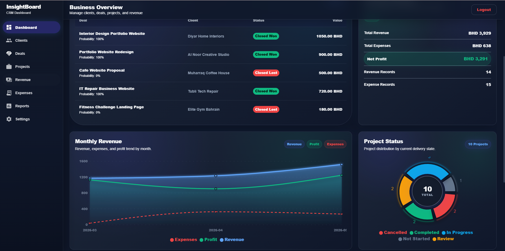
</p>

InsightBoard includes a premium SaaS-style landing page, protected admin dashboard, CRM modules, finance tracking, and business reports.

### Dashboard Screenshots

| Dashboard | Clients |
|---|---|
| 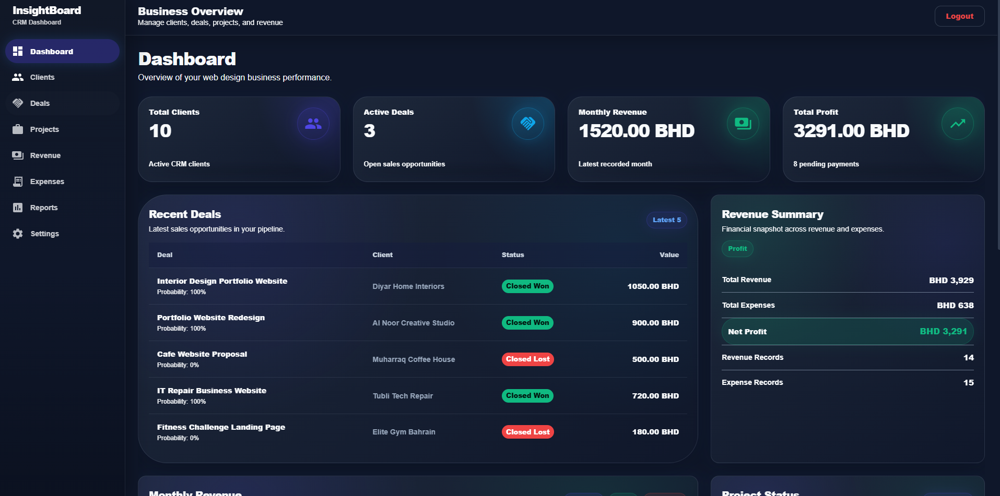 | 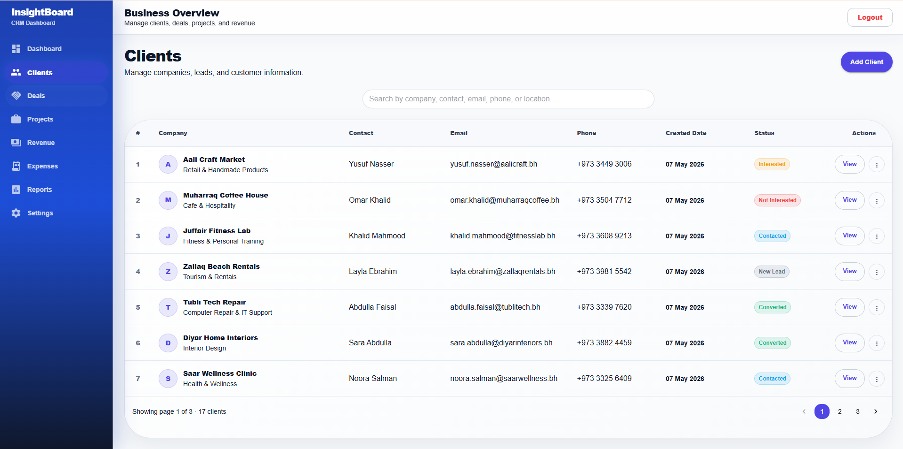 |

| Deals | Projects |
|---|---|
| 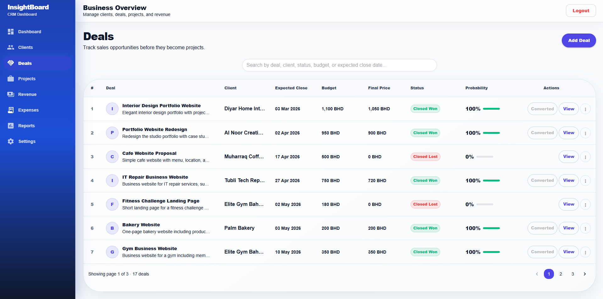 | 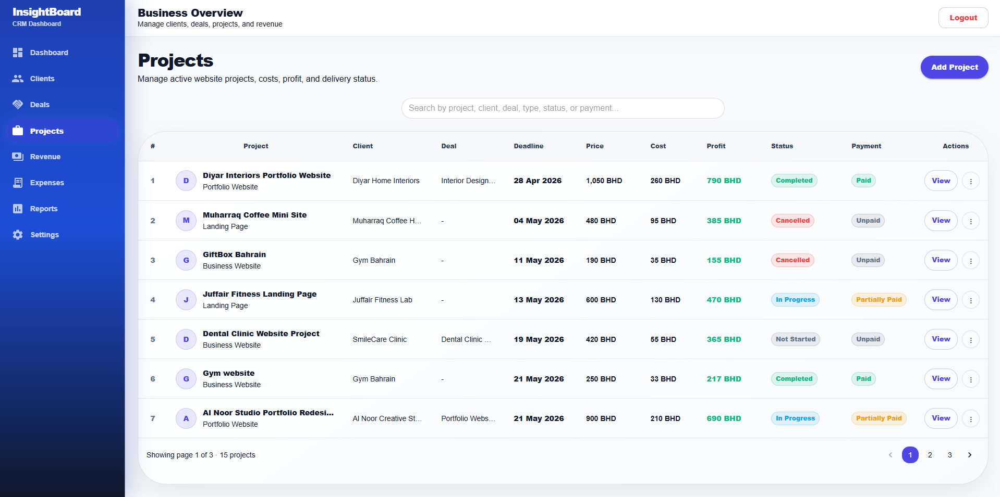 |

| Revenue | Expenses |
|---|---|
| 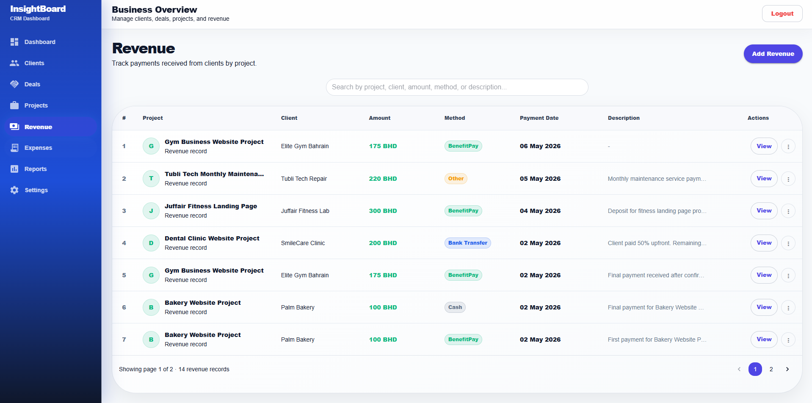 | 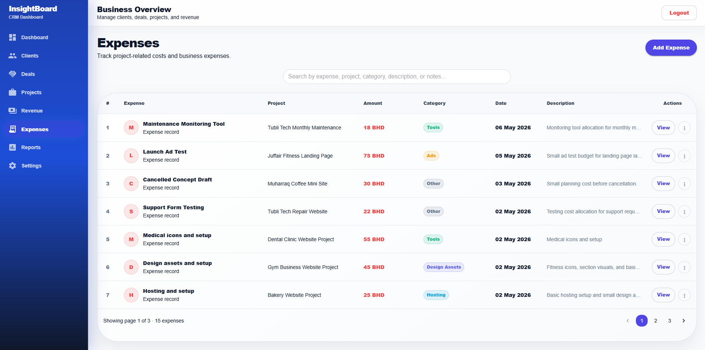 |

| Reports | Settings |
|---|---|
| 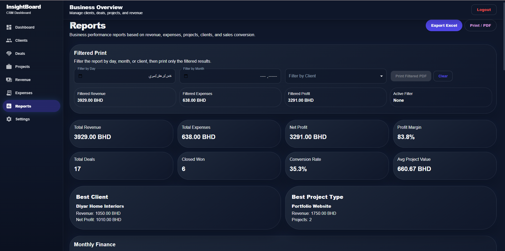 | 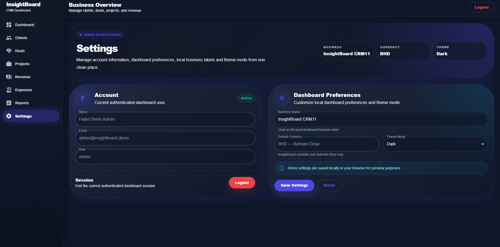 |

| 404 page |  |
|---|---|
| 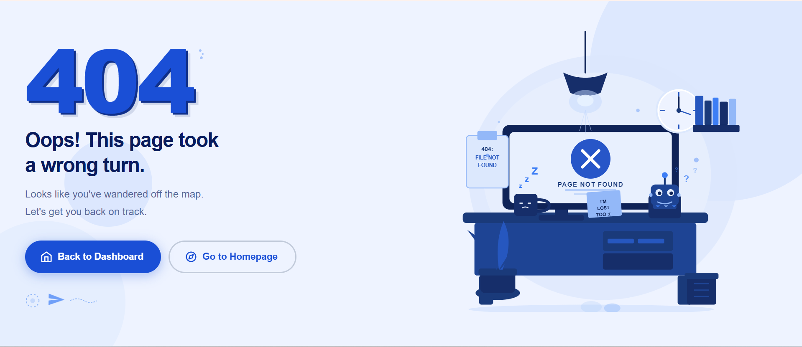  |

| Log In Page | |
|---|---|
| 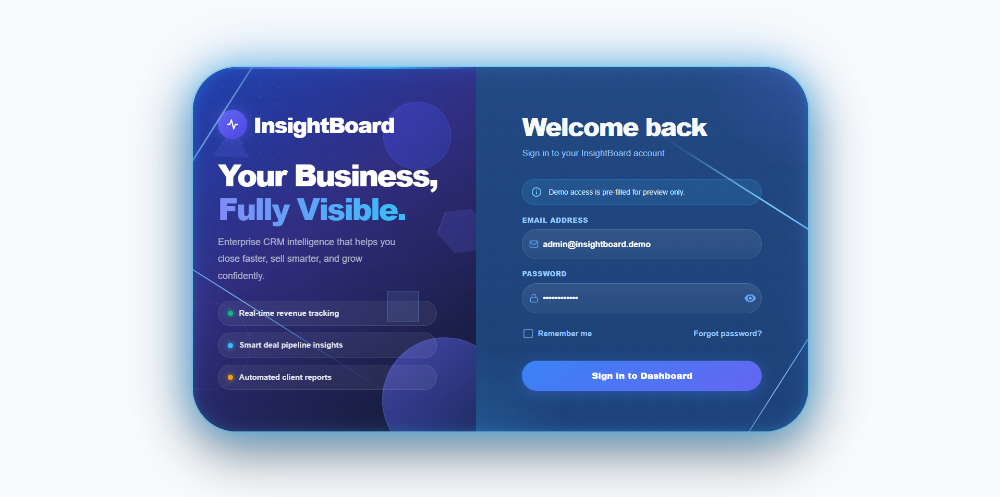  |


## Main Business Workflow

### 1. Add Client

A company or potential customer is added to the CRM.

### 2. Add Deal

A sales opportunity is created and linked to the client.

### 3. Track Deal Progress

The deal moves through the pipeline:

```txt
Lead → Contacted → Proposal Sent → Negotiation → Closed Won / Closed Lost
```

### 4. Convert Deal to Project

If the deal becomes `Closed Won`, it can be converted into a project.

### 5. Track Project Delivery

The project tracks cost, price, profit, deadline, status, and payment status.

### 6. Add Revenue and Expenses

Revenue and expense records are connected to projects.

### 7. Review Reports

Reports summarize business performance across revenue, expenses, clients, projects, project types, and monthly performance.

---

## Future Improvements

Potential future upgrades:

- Multi-user roles and permissions
- File uploads for contracts and invoices
- Email reminders for deadlines
- Advanced analytics filters
- Client portal
- Invoice generation
- Activity logs
- Audit trail for admin actions
- More export formats
- MUI DatePicker replacement for native date inputs
- Production-grade password reset flow
- Dedicated demo seed script

---

## Author

Built by **Fadel Mohammad Fadel**.

- Portfolio: https://fadelprofile.vercel.app
- Contact: https://fadelprofile.vercel.app
- GitHub: https://github.com/Fadelm300

---

## License

This project is currently private
